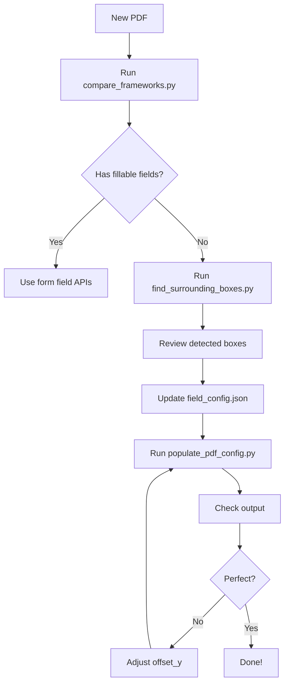

# PDF Population Tools - Complete Reference

## 🎯 Quick Start

```bash
# 1. Activate environment
source venv/bin/activate

# 2. Populate PDF with current config
python populate_pdf_config.py

# 3. View output
open results/populated_config_*.pdf
```

## 📊 All Available Tools

### 1. **populate_pdf_config.py** ⭐ MAIN TOOL

**Purpose:** Populate PDF using JSON configuration

**Features:**
- Reads field_config.json for all settings
- Supports top/middle/bottom alignment
- Applies offset_x and offset_y
- Auto font sizing and wrapping
- Detects existing text

**Usage:**
```bash
python populate_pdf_config.py
```

**Output:** `results/populated_config_TIMESTAMP.pdf`

---

### 2. **find_surrounding_boxes.py** 🔍 BOX DETECTOR

**Purpose:** Automatically find actual input boxes around labels

**Features:**
- Detects field labels (성명, 주소, etc.)
- Searches right/below for input boxes
- Filters by size (excludes borders)
- Recommends offset values
- Generates JSON report

**Usage:**
```bash
python find_surrounding_boxes.py
```

**Output:**
- Console: Table of detected boxes
- File: `results/surrounding_boxes_TIMESTAMP.json`

**When to use:**
- Initial setup of new PDF
- When configured boxes don't match actual input areas
- To find precise coordinates automatically

---

### 3. **populate_pdf_visual_debug.py** 👁️ VISUAL DEBUGGER

**Purpose:** Create visual comparison of boxes and text placement

**Features:**
- Shows BLUE boxes (configured)
- Shows GREEN boxes (detected surrounding)
- Shows RED lines (text baseline)
- Shows BLACK text (actual data)
- Includes legend

**Usage:**
```bash
python populate_pdf_visual_debug.py
```

**Output:** `results/visual_debug_TIMESTAMP.pdf`

**What to check:**
- Are BLUE and GREEN boxes similar? → Good!
- Big difference? → Use GREEN coordinates
- RED line position → Fine-tune with offset_y

---

### 4. **compare_frameworks.py** 📋 FRAMEWORK COMPARISON

**Purpose:** Compare PDF analysis frameworks

**Features:**
- Tests PyMuPDF, pypdf, pdfplumber
- Shows widget detection
- Shows rectangle detection
- Shows text label detection
- Maps labels to boxes

**Usage:**
```bash
python compare_frameworks.py
```

**Output:**
- Console: Comparison table
- File: `results/framework_comparison.json`

---

### 5. **populate_pdf_auto_fit.py** 🎨 AUTO-FITTING

**Purpose:** Populate with automatic font size adjustment

**Features:**
- Scales font to fit box width
- Wraps long text
- Works without config file

**Usage:**
```bash
python populate_pdf_auto_fit.py
```

**Output:** `results/populated_autofit_TIMESTAMP.pdf`

---

### 6. **populate_pdf_aligned.py** 📏 PERFECT ALIGNMENT

**Purpose:** Simple population with precise alignment

**Features:**
- Uses exact measured coordinates
- Clean code, easy to understand
- No config file needed

**Usage:**
```bash
python populate_pdf_aligned.py
```

**Output:** `results/populated_aligned_TIMESTAMP.pdf`

---

### 7. **populate_pdf_debug.py** 🔧 BASIC DEBUGGER

**Purpose:** Shows colored boxes around fields

**Features:**
- Red, blue, green boxes for different fields
- Labels above boxes
- Simple visualization

**Usage:**
```bash
python populate_pdf_debug.py
```

**Output:** `results/populated_debug_TIMESTAMP.pdf`

---

## 🔄 Typical Workflow

### For New PDF Forms



### For Adjusting Alignment

```
1. Run populate_pdf_visual_debug.py
2. Open visual_debug_*.pdf
3. Check:
   - Is text in GREEN box? ✅ Good
   - Text outside GREEN box? ⚠️ Needs adjustment
4. Adjust in field_config.json:
   Option A: Change "offset_y": -10
   Option B: Change "box" coordinates
5. Re-run populate_pdf_config.py
6. Repeat until perfect
```

## 📁 Configuration Files

### field_config.json (Main Config)

```json
{
  "pdf_template": "pdf/your_file.pdf",
  "fields": [
    {
      "id": "field_name",
      "label": "Display Name",
      "json_key": "data_key",
      "box": {
        "x0": 100, "x1": 200,
        "y0": 150, "y1": 170
      },
      "fontsize": 10,
      "alignment": "top",
      "allow_wrap": false,
      "offset_x": 0,
      "offset_y": -10,
      "min_fontsize": 6
    }
  ],
  "settings": {
    "padding_horizontal": 3,
    "default_fontname": "helv",
    "default_color": [0, 0, 0]
  }
}
```

### inputs/test.json (Data)

```json
{
  "parsedJson": {
    "name": "John Doe",
    "id_number": "123-456-7890",
    "address": "123 Main St, City",
    "phone": "555-1234"
  }
}
```

## 🎨 Output Files

All outputs go to `results/` folder:

| File Pattern | Tool | Purpose |
|-------------|------|---------|
| `populated_config_*.pdf` | populate_pdf_config.py | Main output |
| `visual_debug_*.pdf` | populate_pdf_visual_debug.py | Visual comparison |
| `surrounding_boxes_*.json` | find_surrounding_boxes.py | Detected boxes |
| `framework_comparison.json` | compare_frameworks.py | Framework analysis |
| `populated_autofit_*.pdf` | populate_pdf_auto_fit.py | Auto-sized text |
| `populated_aligned_*.pdf` | populate_pdf_aligned.py | Simple alignment |

## 🔧 Common Tasks

### Task: Find correct box coordinates

```bash
python find_surrounding_boxes.py
# Review output
# Copy box coordinates to field_config.json
```

### Task: Fine-tune text position

Edit `field_config.json`:
```json
"offset_y": -10  // Try different values: -5, -10, -15
```

Then test:
```bash
python populate_pdf_config.py
```

### Task: Visual verification

```bash
python populate_pdf_visual_debug.py
open results/visual_debug_*.pdf
```

Check:
- BLUE box = configured
- GREEN box = detected actual
- RED line = text position

### Task: Compare detection methods

```bash
python compare_frameworks.py
# Review which framework finds boxes best
```

## 📊 Decision Matrix

### Which tool to use?

| Situation | Use This Tool |
|-----------|--------------|
| **Regular use** | populate_pdf_config.py |
| **Find boxes** | find_surrounding_boxes.py |
| **Check alignment** | populate_pdf_visual_debug.py |
| **New PDF analysis** | compare_frameworks.py |
| **Quick test** | populate_pdf_auto_fit.py |
| **Learning** | populate_pdf_aligned.py |

### When to use offsets vs new boxes?

| Offset Situation | Action |
|-----------------|--------|
| Text 5-15pts off | Use offset_y |
| Text 20+pts off | Use surrounding boxes |
| Box size wrong | Use surrounding boxes |
| Just need tweak | Use offset_y |

## 🎯 Current Status

**Your PDF Configuration:**

```
Name Field:
  Configured: y=165.3-189.4
  Actual: y=209.5-225.1
  Status: ⚠️ Consider using surrounding box

ID Number Field:
  Configured: y=165.3-189.4
  Actual: y=190.6-225.4
  Status: ⚠️ Consider using surrounding box

Contact Field:
  Configured: y=165.3-189.4
  Actual: y=190.6-225.4
  Status: ⚠️ Consider using surrounding box

Address Field:
  Configured: y=277.6-320.8
  Actual: y=277.6-320.8
  Status: ✅ Using correct box!
```

## 💡 Tips & Tricks

### Tip 1: Start with visual debug

Always run visual debug first to see the current state:
```bash
python populate_pdf_visual_debug.py
```

### Tip 2: Use surrounding boxes as baseline

Run detection and use those coordinates:
```bash
python find_surrounding_boxes.py
# Copy suggested box coordinates
```

### Tip 3: Fine-tune with small offsets

After setting correct boxes, adjust with ±2-5pt offsets:
```json
"offset_y": -3  // Small adjustment
```

### Tip 4: Test with real data

Use actual long addresses and names to test wrapping:
```json
"address": "Very long address that will test wrapping..."
```

### Tip 5: Keep versions

Save different configs for testing:
```bash
cp field_config.json field_config_v1.json
# Make changes
# Test
# If bad, restore: cp field_config_v1.json field_config.json
```

## 📖 Documentation Files

| File | Contents |
|------|----------|
| **TOOLS_SUMMARY.md** | This file - all tools reference |
| **OFFSET_GUIDE.md** | Using offsets and surrounding boxes |
| **CONFIG_GUIDE.md** | Field configuration reference |
| **ALIGNMENT_FIX.md** | Top alignment fix details |
| **FINAL_SUMMARY.md** | Overall solution summary |
| **README.md** | Project overview |
| **SETUP.md** | Installation guide |

## 🚀 Example Session

```bash
# 1. Analyze PDF
python compare_frameworks.py
# Result: No fillable fields, use coordinate approach

# 2. Find actual input boxes
python find_surrounding_boxes.py
# Result: Address box at y=277.6-320.8

# 3. Update config
nano field_config.json
# Update address box coordinates

# 4. Test population
python populate_pdf_config.py
# Output: results/populated_config_*.pdf

# 5. Visual verification
python populate_pdf_visual_debug.py
open results/visual_debug_*.pdf
# Check: Text aligns with GREEN box

# 6. Fine-tune if needed
# Edit offset_y in field_config.json
python populate_pdf_config.py

# 7. Done!
```

## ✅ Verification Checklist

Before finalizing configuration:

- [ ] Run visual_debug - check box alignment
- [ ] Text inside GREEN boxes?
- [ ] RED lines at appropriate position?
- [ ] Test with longest expected text
- [ ] Test with shortest expected text
- [ ] Check all 4 fields (name, ID, phone, address)
- [ ] Verify no overlap with pre-printed text
- [ ] Check font size is readable
- [ ] Ensure wrapped text fits in box

## 📞 Quick Reference

```bash
# Main tool (production)
python populate_pdf_config.py

# Find boxes (setup)
python find_surrounding_boxes.py

# Visual check (debugging)
python populate_pdf_visual_debug.py

# Framework test (analysis)
python compare_frameworks.py
```

## 🎉 Success Criteria

Your PDF population is perfect when:
1. ✅ Text appears in correct input areas
2. ✅ No overlap with pre-printed text
3. ✅ All fields properly aligned (top/middle/bottom)
4. ✅ Long text wraps correctly
5. ✅ Font size is appropriate and readable
6. ✅ Visual debug shows text in GREEN boxes

---

**Last Updated:** 2025-11-26
**Status:** All tools working and documented
**Current Config:** Using surrounding boxes for address field
